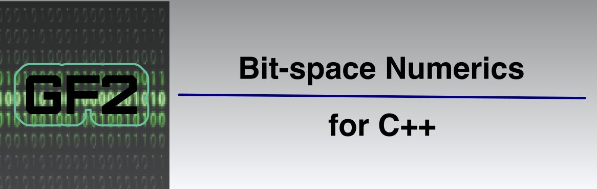

# Project Overview

<p align="center"></p>

The `gf2` library focuses on efficient _numerical_ work in _bit-space_, where mathematical entities such as vectors, matrices, and polynomial coefficients are limited to zeros and ones.

All arithmetic is carried out modulo 2, so what starts in bit-space stays in bit-space. Addition/subtraction becomes the `XOR` operation, and multiplication/division becomes the `AND` operation. The `gf2` library uses those equivalences to efficiently perform most operations by simultaneously operating on entire blocks of elements at a time.

Mathematicians refer to bit-space as [GF(2)][] or $\mathbb{F}_2$. It is the simplest [Galois Field] with just two elements, 0 and 1.

While computer hardware famously operates on bits, computers don't really provide _direct_ access to _single_ bits.

Instead, computers have memory registers for _words_ where the smallest addressable unit is an eight-bit word, a _byte_.
Other "native" word lengths vary by computer architecture, but 8, 16, 32, 64, and even 128-bit words are widely supported.
Computers perform operations on and between those short word types optimally.

Computers have many primitive data types --- bytes, characters, various-sized integers (positive or negative), and floating-point numbers with various degrees of precision.
Blocks of zeros and ones are best modelled by the simplest _unsigned integer_ primitive types.

In this library, we pack contiguous bit elements into arrays of one of those unsigned word types

For example, if we have a bit-vector of size 200, and the underlying word is a `std::uint64_t`, the bit elements will be packed into four words (a total of 256 bits), and there will be 56 bits of unused capacity.
The library will efficiently perform almost all operations on that vector 64 bits at a time in an inherently parallel manner.

## Main Classes

This header-only library provides the following main classes:

| Class Name     | Description                                       |
| -------------- | ------------------------------------------------- |
| [`BitArray`][] | A fixed-size vector of bits.                      |
| [`BitVec`][]   | A dynamically-sized vector of bits.               |
| [`BitSpan`][]  | A non-owning view into contiguous ranges of bits. |
| [`BitPoly`][]  | A polynomial over GF(2).                          |
| [`BitMat`][]   | A matrix over GF(2).                              |

The `BitArray`, `BitVec`, and `BitSpan` classes share many methods, and all implement the [`BitStore`][] concept, which provides a rich interface for manipulating collections of bits. The functions include bit accessors, mutators, fills, queries, iterators, stringification methods, bit-wise operators, arithmetic operators, and more.

There are other classes to support linear algebra operations, such as solving systems of linear equations, finding matrix inverses, and computing eigenvalues and eigenvectors. Among other things, the interface includes methods for examining the eigen-structure of large bit matrices.

The `BitPoly` class has methods to compute $x^N\bmod{p(x)}$ where $p(x)$ is a polynomial over $\mathbb{F}_2$ and $N$ is a potentially huge integer.

The classes are efficient and pack the individual bit elements into natural unsigned word blocks.
There is a rich interface for setting up and manipulating these classes, as well as allowing them to interact with each other.

> [!NOTE]
> Operations on and between objects in the `gf2` library are implemented using bitwise operations on whole underlying words at a time.
> This means we never have to worry about overflows or carries as we would with normal integer arithmetic.
> Moreover, these operations are highly optimised in modern CPUs, enabling fast computation even on large bit matrices and bit vectors.

## A Simple Example

Here is a simple example of a program that uses `gf2`:

```c++
#include <gf2/namespace.h>
int main()
{
    auto M = BitMat<>::random(6, 6);
    auto c = M.characteristic_polynomial();
    std::println("The bit-matrix M:\n{}", M);
    std::println("has characteristic polynomial c(x) = {}", c);
    std::println("The polynomial sum c(M) is:");
    std::println("{}", c(M));
}
```

-   This program creates a random 6 x 6 bit-matrix `M` where the entries 0 and 1 are equally likely to occur.
-   It then extracts the characteristic polynomial $c(x) = c_0 + c_1 x + c_2 x^2 + ... + c_6 x^6$.
-   Finally, it verifies that `M` satisfies its characteristic equation, $c(M) = 0$ as expected from the [Cayley-Hamilton] theorem.

Here is the output from one run of the program:

```txt
The bit-matrix M:
│0 1 1 0 0 0│
│0 0 1 0 1 0│
│1 1 0 0 0 1│
│0 0 0 0 0 1│
│0 1 0 0 1 1│
│1 1 0 1 0 1│
has characteristic polynomial c(x) = x^1 + x^4 + x^6.
The polynomial sum c(M) gives:
│0 0 0 0 0 0│
│0 0 0 0 0 0│
│0 0 0 0 0 0│
│0 0 0 0 0 0│
│0 0 0 0 0 0│
│0 0 0 0 0 0│
```

> [!NOTE]
> The `gf2` library makes it possible to quickly extract the characteristic polynomial for a bit-matrix with millions of elements. This problem chokes a naive implementation that fails to account for the unique nature of arithmetic in GF(2).

## Use Cases

The standard library already has [`std::bitset`][], an efficient _bitset_ class that is familiar and well-thought-out, so our classes replicate and extend much of that interface.

All `std::bitset` objects have a fixed size determined at compile time. The well-known _Boost_ library introduces a dynamic version [`boost::dynamic_bitset`][] whose size can be set and changed at runtime.

However, as the two names suggest, these types are aimed at sets of bits instead of _vectors_ of bits. So, for example, they print in _bit-order_ with the least significant element/bit on the right. More importantly, those classes don't have any particular methods for linear algebra, and neither does the standard library's vector class, `std::vector`.

On the other hand, several well-known linear algebra libraries, such as [Eigen][], exist. Those packages efficiently manage all the standard _numeric_ types (floats, doubles, integers, etc.) but do not correctly handle GF(2). You can create matrices of integers whose elements are 0 or 1, but there is no built-in knowledge in those libraries that arithmetic is mod 2.

For example, you might use `Eigen` to create an integer matrix of all 0's and 1's and then use a built-in function from that library to extract the characteristic polynomial. Modding the coefficients of that polynomial by 2 gets the appropriate version for GF(2). Technically, this works, but you will have overflow problems for even relatively modest-sized matrices with just a few hundred rows and columns. Of course, you might use an underlying `BitInt` type that never overflows, but the calculations become dog slow for larger bit-matrices, which doesn't help much.

This specialised `gf2` library is better suited to linear algebra over GF(2). Consider it if, for example, your interest is in cryptography or random number generation.

## Installation

This library is header-only, so there is nothing to compile and link. Drop the `gf2` include directory somewhere convenient, and you're good to go.

Alternatively, if you are using `CMake`, you can use the standard `FetchContent` module by adding a few lines to your project's `CMakeLists.txt` file:

```cmake
include(FetchContent)
FetchContent_Declare(gf2 URL https://github.com/nessan/gf2/releases/download/current/gf2.zip)
FetchContent_MakeAvailable(gf2)
```

This command downloads and unpacks an archive of the current version of the `gf2` library to your project's build folder. You can then add a dependency on `gf2::gf2`, a `CMake` alias for the `gf2` library. `FetchContent` will automatically ensure the build system knows where to find the downloaded header files and any needed compiler flags.

Used in this manner, FetchContent will only download a minimal library version, excluding redundant test code, sample programs, documentation files, and other unnecessary content.

## Rust Version

A Rust version of this library is also available on [crates.io,](https://crates.io/crates/gf2-rs) and the source code is available on [GitHub](https://github.com/nessan/gf2_rs).

The C++ version predates the Rust crate. The port to Rust was done _manually—at least for now. LLMs cannot handle this sort of translation task and produce anything that is at all readable or verifiable.

As you might expect with a rewrite, the new version considerably improved on the original. There were two beneficial factors at play:

- We approached the problem anew, and fresh eyes quickly saw several areas for improvement that had nothing to do with the implementation language per se.
- Other improvements came about _because_ we were using a different language with its own idioms, strengths, and weaknesses that forced some new thinking.

The C++ version has been completely rewritten to incorporate those improvements and to backport some of the new ideas from using Rust.

Writing solutions to the same problem in multiple languages has significant benefits, but of course, it is rather expensive and unlikely to find favour in commercial settings.

Perhaps we should repeat the exercise for a third language someday!

For the most part, the two versions are feature equivalent (a few things are not possible in Rust). There are some name changes to accommodate idioms in the languages; for example, the BitSpan C++ class corresponds to the `BitSlice` type in Rust (C++ uses spans, Rust uses slices), C++ vectors have a `size()` method, Rust vectors have a `len()` method, and so on.

The two versions have very similar performance characteristics, with neither being significantly faster than the other in most scenarios.

## Useful Links

Here are links to the project's [repository][] and [documentation site][]

The project uses [Doxytest][], a tool for generating C++ test programs from sample code embedded in header file comments.

You can contact me by [email][].

### Copyright and License

Copyright (c) 2022-present Nessan Fitzmaurice.
You can use this software under the [MIT license][].

<!-- Reference Links -->

[repository]: https://github.com/nessan/gf2
[documentation site]: https://nessan.github.io/gf2
[email]: mailto:nzznfitz+gh@icloud.com
[MIT License]: https://opensource.org/license/mit
[Doxytest]: https://nessan.github.io/doxytest/
[GF(2)]: https://en.wikipedia.org/wiki/GF(2)
[Galois Field]: https://en.wikipedia.org/wiki/Galois_field
[Eigen]: https://eigen.tuxfamily.org/overview.php?title=Main_Page
[Cayley-Hamilton]: https://en.wikipedia.org/wiki/Cayley%E2%80%93Hamilton_theorem
[`std::bitset`]: https://en.cppreference.com/w/cpp/utility/bitset
[`boost::dynamic_bitset`]: https://www.boost.org/doc/libs/1_80_0/libs/dynamic_bitset/dynamic_bitset.html
[`BitStore`]: docs/pages/BitStore.md
[`BitArray`]: docs/pages/BitArray.md
[`BitVec`]: docs/pages/BitVec.md
[`BitSpan`]: docs/pages/BitSpan.md
[`BitPoly`]: docs/pages/BitPoly.md
[`BitMat`]: docs/pages/BitMat.md
