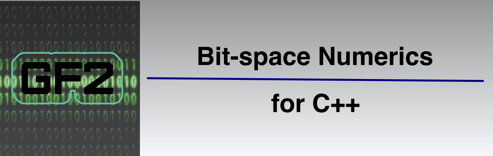

# Project Overview

<p align="center"></p>

The `gf2` library focuses on efficient numerical work in _bit-space_.

All arithmetic operations in bit-space are mod 2, so what starts in bit-space stays in bit-space. Addition/subtraction becomes the `XOR` operation, and multiplication/division becomes the `AND` operation. The `gf2` library uses those equivalences to efficiently perform most operations by simultaneously operating on entire blocks of elements.

Mathematicians refer to bit-space as [GF2][] or $\mathbb{F}_2$. It is the simplest [Galois Field] with just two elements, 0 and 1.

This header-only library provides the following main classes:

| Class Name    | Description                                          |
| ------------- | ---------------------------------------------------- |
| [`BitSet`][]  | For fixed-size vectors of bits.                      |
| [`BitVec`][]  | For dynamically-sized vector of bits.                |
| [`BitSpan`][] | For non-owning views into contiguous ranges of bits. |
| [`BitPoly`][] | For polynomials over GF(2).                          |
| [`BitMat`][]  | For matrices of bit elements over GF(2).             |

The `BitSet`, `BitVec`, and `BitSpan` classes all inherit from a common [`BitStore`][] base class, which provides a rich interface for manipulating collections of bits.

There are other classes to support linear algebra operations, such as solving systems of linear equations, finding matrix inverses, and computing eigenvalues and eigenvectors. Among other things, the interface includes methods for examining the eigen-structure of large bit matrices.

The `BitPoly` class has methods to compute $x^N\bmod{p(x)}$ where $p(x)$ is a polynomial over $\mathbb{F}_2$ and $N$ is a potentially huge integer.

The classes are efficient and pack the individual bit elements into natural unsigned word blocks.
There is a rich interface for setting up and manipulating these classes, as well as allowing them to interact with each other.

> [!NOTE]
> Operations on and between objects in the `gf2` library are implemented using bitwise operations on whole underlying words at a time.
> These operations are highly optimised in modern CPUs, allowing for fast computation even on large bitsets.
> It also means we never have to worry about overflows or carries as we would with normal integer arithmetic.

## A Simple Example

Here is a simple example of a program that uses `gf2`:

```c++
#include <gf2/namespace.h>
int main()
{
    auto M = BitMat<>::random(6, 6);
    auto c = M.characteristic_polynomial();
    std::println("The bit-matrix M:\n{}", M);
    std::println("has characteristic polynomial c(x) = {}", c);
    std::println("The polynomial sum c(M) is:");
    std::println("{}", c(M));
}
```

-   This program creates a random 6 x 6 bit-matrix `M` where the entries 0 and 1 are equally likely to occur.
-   It then extracts the characteristic polynomial $c(x) = c_0 + c_1 x + c_2 x^2 + ... + c_6 x^6$.
-   Finally, it verifies that `M` satisfies its characteristic equation, $c(M) = 0$ as expected from the [Cayley-Hamilton] theorem.

Here is the output from one run of the program:

```txt
The bit-matrix M:
│0 1 1 0 0 0│
│0 0 1 0 1 0│
│1 1 0 0 0 1│
│0 0 0 0 0 1│
│0 1 0 0 1 1│
│1 1 0 1 0 1│
has characteristic polynomial c(x) = x^1 + x^4 + x^6.
The polynomial sum c(M) gives:
│0 0 0 0 0 0│
│0 0 0 0 0 0│
│0 0 0 0 0 0│
│0 0 0 0 0 0│
│0 0 0 0 0 0│
│0 0 0 0 0 0│
```

> [!NOTE]
> The `gf2` library makes it possible to quickly extract the characteristic polynomial for a bit-matrix with millions of elements. This problem chokes a naive implementation that needs to account for the unique nature of arithmetic in GF(2).

## Use Cases

The standard library already has [`std::bitset`][], an efficient _bitset_ class that is familiar and well thought through, so our classes replicate and extend much of that interface.

All `std::bitset` objects have a fixed size determined at compile time. The well-known _Boost_ library introduces a dynamic version [`boost::dynamic_bitset`][] whose size can be set and changed at runtime.

However, as the two names suggest, these types are aimed at sets of bits instead of _vectors_ of bits. So, for example, they print in _bit-order_ with the least significant element/bit on the right. More importantly, those classes don't have any particular methods aimed at linear algebra, and neither does the standard library's vector class `std::vector`.

On the other hand, several well-known linear algebra libraries, such as [Eigen][], exist. Those packages efficiently manage all the standard _numeric_ types (floats, doubles, integers, etc.) but do not correctly handle GF(2). You can create matrices of integers whose elements are 0 or 1, but there is no built-in knowledge in those libraries that arithmetic is mod 2.

For example, you might use `Eigen` to create an integer matrix of all 0's and 1's and then use a built-in function from that library to extract the characteristic polynomial. Modding the coefficients of that polynomial by 2 gets the appropriate version for GF(2). Technically, this works, but you will have overflow problems for even relatively modest-sized matrices with just a few hundred rows and columns. Of course, you might use an underlying `BitInt` type that never overflows, but the calculations become dog slow for larger bit-matrices, which doesn't help much.

This specialised `gf2` library is better suited to linear algebra over GF(2). Consider it if, for example, your interest is in cryptography or random number generation.

## Installation

This library is header-only, so there is nothing to compile and link. Drop the `gf2` include directory somewhere convenient, and you're good to go.

Alternatively, if you are using `CMake`, you can use the standard `FetchContent` module by adding a few lines to your project's `CMakeLists.txt` file:

```cmake
include(FetchContent)
FetchContent_Declare(gf2 URL https://github.com/nessan/gf2/releases/download/current/gf2.zip)
FetchContent_MakeAvailable(gf2)
```

This command downloads and unpacks an archive of the current version of the `gf2` library to your project's build folder. You can then add a dependency on `gf2::gf2`, a `CMake` alias for the `gf2` library. `FetchContent` will automatically ensure the build system knows where to find the downloaded header files and any needed compiler flags.

Used in this manner, FetchContent will only download a minimal library version, excluding redundant test code, sample programs, documentation files, and other unnecessary content.

## Useful Links

Here are links to the project's [repository][] and [documentation site][]

The project uses [Doxytest][], a tool for generating C++ test programs from sample code embedded in header file comments.

You can contact me by [email][].

### Copyright and License

Copyright (c) 2022-present Nessan Fitzmaurice.
You can use this software under the [MIT license][].

<!-- Reference Links -->

[repository]: https://github.com/nessan/gf2
[documentation site]: https://nessan.github.io/gf2
[email]: mailto:nzznfitz+gh@icloud.com
[MIT License]: https://opensource.org/license/mit
[Doxytest]: https://nessan.github.io/doxytest/
[GF2]: https://en.wikipedia.org/wiki/GF(2)
[Galois Field]: https://en.wikipedia.org/wiki/Galois_field
[Eigen]: https://eigen.tuxfamily.org/overview.php?title=Main_Page
[Cayley-Hamilton]: https://en.wikipedia.org/wiki/Cayley%E2%80%93Hamilton_theorem
[`std::bitset`]: https://en.cppreference.com/w/cpp/utility/bitset
[`boost::dynamic_bitset`]: https://www.boost.org/doc/libs/1_80_0/libs/dynamic_bitset/dynamic_bitset.html
[`BitStore`]: docs/pages/BitStore.md
[`BitSet`]: docs/pages/BitSet.md
[`BitVec`]: docs/pages/BitVec.md
[`BitSpan`]: docs/pages/BitSpan.md
[`BitPoly`]: docs/pages/BitPoly.md
[`BitMat`]: docs/pages/BitMat.md
